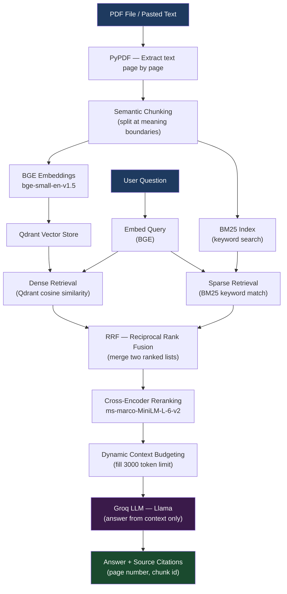

# Notebook 1 — TraceIQ: PDF Question Answering with Hybrid RAG

This is where the project starts. This notebook reads a PDF and answers questions about it.

The notebook does not just do basic search. It combines several techniques to make retrieval much better than a simple chunk-and-search approach.

---

## System Architecture



---

## What the Notebook Does

You upload a PDF (or paste some text), the notebook indexes it, and then you ask questions about it through a Gradio interface. The system finds the most relevant parts of the document and uses an LLM to generate an answer grounded in those parts — with source citations so you can verify where the answer came from.

---

## The Problem With Basic RAG

A simple RAG pipeline looks like this:

```
PDF → split into chunks → embed → vector search → answer
```

This works, but it has real problems:

- **Keyword misses** — semantic search finds meaning but can miss exact technical terms
- **Context loss** — a chunk might be relevant but you lose the bigger picture
- **Bad ranking** — similarity score alone does not mean the chunk is the most useful
- **Token waste** — sending all retrieved chunks to the LLM is expensive

This notebook solves all of these one by one.

---

## What Is Built — Step by Step

### Step 1 — Parse the PDF
PyPDF extracts text page by page. Each page is saved with its page number for source tracking later.

### Step 2 — Semantic Chunking
Text is split where the meaning changes, not at a fixed word count. This keeps related sentences together in the same chunk.

Bad chunking example:
```
Chunk 1: "Self-attention computes a weighted"
Chunk 2: "sum of values using query-key scores..."
```

Good chunking (semantic):
```
Chunk 1: "Self-attention computes a weighted sum of values using query-key scores."
```

### Step 3 — BGE Embeddings
Each chunk is converted into a 384-dimensional vector using `BAAI/bge-small-en-v1.5`. This captures *meaning*, not just keywords.

### Step 4 — Qdrant Vector Database
All embeddings are stored in Qdrant for fast similarity search.

### Step 5 — BM25 Keyword Search
All chunks are also indexed with BM25. This finds exact keyword matches — useful for technical terms, function names, and identifiers that semantic search can miss.

### Step 6 — Reciprocal Rank Fusion (RRF)
Dense retrieval and BM25 each return their own ranked list. RRF merges both into one better combined list.

```
Dense results:  [Chunk A, Chunk B, Chunk C]
BM25 results:   [Chunk C, Chunk A, Chunk D]
RRF result:     [Chunk A, Chunk C, Chunk B, Chunk D]
```

### Step 7 — Cross-Encoder Reranking
The top candidates are re-scored using `cross-encoder/ms-marco-MiniLM-L-6-v2`. Unlike cosine similarity (which compares vectors separately), a cross-encoder reads the query and each chunk *together* and gives a more accurate relevance score.

### Step 8 — Dynamic Context Budgeting
A token budget is enforced (3000 tokens). Chunks are added one by one until the budget is full. This prevents sending too much to the LLM.

```
Budget: 3000 tokens
Chunk A: 500  → add (total: 500)
Chunk B: 700  → add (total: 1200)
Chunk C: 600  → add (total: 1800)
Chunk D: 1500 → skip (would exceed budget)
```

### Step 9 — Answer Generation
The selected context is sent to the LLM (Groq / Llama) with a prompt that says: answer only from the given context, do not make anything up.

### Step 10 — Source Tracking
The system shows which page and chunk number the answer came from:
```
Source: page 3, chunk 2
Source: page 4, chunk 1
```

---

## Tools and Libraries Used

| Tool | What it does |
|------|-------------|
| PyPDF | Reads PDF files |
| `BAAI/bge-small-en-v1.5` | Converts text to vectors (embeddings) |
| Qdrant | Stores and searches vectors |
| BM25 (rank-bm25) | Keyword search |
| Cross-Encoder | Reranks retrieved chunks |
| Tiktoken | Counts tokens for budget |
| Groq | Runs the LLM (Llama model) |
| Gradio | Interactive web interface |

---

## How to Run

1. Open `TraceIQ_PDF.ipynb` in **Google Colab**
2. Add your `GROQ_API_KEY` to Colab Secrets (left sidebar → key icon)
3. Run all cells from top to bottom
4. The Gradio interface launches at the bottom — upload a PDF or paste text, then ask a question

---

## API Keys Needed

| Key | Where to get it |
|-----|----------------|
| `GROQ_API_KEY` | [console.groq.com](https://console.groq.com) — free tier available |

---

## Design Choices

| Component | Choice | Why |
|-----------|--------|-----|
| Chunking | Semantic chunking | Keeps related ideas together |
| Embeddings | BGE Small | Better retrieval quality than MiniLM |
| Vector DB | Qdrant | Fast, production-ready, good metadata support |
| Keyword search | BM25 | Strong exact matching for technical terms |
| Fusion | RRF | Simple way to combine two ranked lists |
| Reranker | Cross-Encoder | More accurate than cosine similarity alone |
| LLM | Groq (Llama) | Fast inference, free API for experiments |
| Interface | Gradio | Easy to use, runs in Colab |

---

## What I Learned Building This

- Semantic chunking keeps meaning together and makes a real difference in retrieval quality
- Hybrid search (dense + BM25) covers both meaning and keywords — neither alone is enough
- Cross-encoder reranking noticeably improves which chunks actually get used
- A token budget keeps costs low and avoids stuffing the prompt with irrelevant content
- Source tracking lets users verify answers themselves — important for trust

