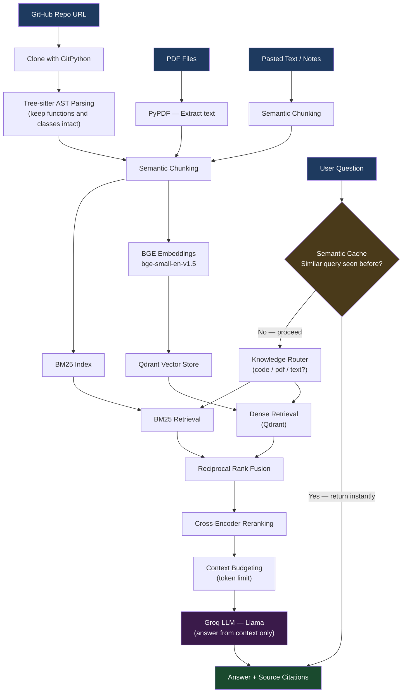

# Notebook 2 — TraceIQ Advanced RAG: Multi-Source Search Across Code and Docs

Notebook 1 could answer questions from a single PDF. This notebook takes that further.

Here I built a system that can search across multiple knowledge sources at the same time — GitHub repositories, PDF documents, and plain text notes. You can ask one question and get an answer that pulls from all of these.

The big addition in this notebook is **code understanding**. Instead of treating code as plain text, I parse it using Tree-sitter (which understands the actual structure of Python and JavaScript code) and extract complete functions, classes, and methods as chunks.

---

## System Architecture



---

## What This Notebook Does

You can give the system:
- A GitHub repository URL (it clones and indexes the code)
- One or more PDF files
- Any text you paste in (notes, documentation, specs)

Then you ask a question and the system searches all of these sources together and gives you a grounded answer with citations.

---

## Why I Built This

Most RAG tutorials focus on PDFs. But real engineering teams work across many sources — code, docs, internal notes, research papers. I wanted to build something that could search all of these at once.

---

## What Changed From Notebook 1

| Feature | Notebook 1 | Notebook 2 |
|---------|------------|------------|
| Sources | Single PDF | GitHub repos + multiple PDFs + text |
| Code chunking | Not supported | AST-based (Tree-sitter) |
| Routing | No routing | Knowledge Router decides where to search |
| Caching | No caching | Semantic cache for repeated queries |
| Interface | Gradio | Gradio (multi-source) |

---

## How It Works

### Source 1 — GitHub Repositories

I clone the repository locally, then parse every Python, JavaScript, and TypeScript file using Tree-sitter.

Tree-sitter reads the code's actual structure (the Abstract Syntax Tree) and extracts:
- Functions
- Classes
- Methods
- Interfaces
- Type definitions

This means a complete function stays in one chunk, not split across two chunks at a random line break.

**Example — what NOT to do (plain text splitting):**
```
Chunk 1: "def authenticate_user(username, password):"
Chunk 2: "    token = generate_token()"
```

**What I do instead (AST-aware chunking):**
```
Chunk 1: "def authenticate_user(username, password):
              token = generate_token()
              return token"
```

The whole function stays together. This makes search results much more useful.

Directories like `node_modules`, `.git`, `build`, and `dist` are ignored because they add noise without useful content.

### Source 2 — PDF Documents

Same as Notebook 1. PyPDF extracts text, semantic chunking splits it at meaning boundaries, and metadata is attached to every chunk (document name, page number, chunk ID).

### Source 3 — Plain Text

You can paste any text directly. Notes, specs, markdown, meeting notes. It all gets chunked and indexed alongside the code and PDFs.

---

## Knowledge Router

Before searching, a lightweight router looks at your question and decides which source is most relevant.

```
"Where is JWT validation implemented?" → route to: Repository
"Summarize the uploaded report" → route to: PDF
"What did I write in my notes about auth?" → route to: Text
```

This improves precision. If you ask a code question, the system does not waste time searching your PDFs first.

Note: The current router is rule-based (simple keyword matching). For a bigger system with many more sources, a semantic router based on embeddings would scale better.

---

## Retrieval Pipeline

After routing, the same hybrid search from Notebook 1 runs:

1. **Dense retrieval** using BGE embeddings and Qdrant
2. **BM25 keyword search** — especially useful for exact function names and API terms
3. **RRF fusion** — combines both ranked lists
4. **Cross-encoder reranking** — picks the best chunks from the fused list
5. **Dynamic context budgeting** — fills the token budget without overflow

---

## Semantic Caching

Before going through the whole retrieval pipeline, the system checks if a very similar question was already asked.

If a previous query is found with similarity above a threshold, the cached answer is returned immediately — no embedding, no vector search, no LLM call.

This saves time and API costs for repeated or similar questions.

---

## Answer Generation

The final context is sent to Groq (Llama model) with a prompt that requires the model to:
- Answer only from the provided context
- Not make up information
- Cite which source the answer came from

---

## Tools Used

| Tool | What it does |
|------|-------------|
| Tree-sitter | Parses code into AST |
| GitPython | Clones repositories |
| BGE Small | Converts text and code to vectors |
| Qdrant | Stores and searches vectors |
| BM25 | Keyword search |
| Cross-Encoder | Reranks retrieved chunks |
| Groq | Runs the LLM |
| Gradio | Web interface |

---

## How to Run

1. Open `1_2DTraceIQ_Advanced_RAG_.ipynb` in Google Colab
2. Add these to Colab secrets:
   - `GROQ_API_KEY`
   - `GITHUB_TOKEN` (for cloning private repos — not needed for public repos)
3. Run all cells top to bottom
4. Use the Gradio interface to add sources and ask questions

---

---

## Why Tree-sitter Instead of Regex?

I initially tried splitting code using regular expressions:

```python
# This approach has problems
pattern = re.finditer(r'def \w+', code)
```

Regex does not understand code structure. It can miss language constructs, split mid-function, and produce false positives. Tree-sitter actually parses the language grammar, which makes it accurate and extensible.

---

## Why I Removed CRAG

An earlier version of this notebook had Corrective RAG (CRAG). After retrieval, an LLM grader would score each chunk and decide whether to search the web if the chunks were not good enough.

I removed it because once I added:
- BGE embeddings
- BM25 hybrid search
- RRF fusion
- Cross-encoder reranking

...retrieval quality was already strong enough that the grading step was not adding enough value to justify the extra latency and cost.

The lesson: better retrieval architecture often beats adding more LLM calls.

---

## What I Learned

- AST-based code chunking is a significant improvement over plain text splitting for code search
- Routing your query to the right source before searching improves precision
- Semantic caching is a cheap way to speed up repeated queries
- Combining all sources (code + docs + notes) into one search space makes the system genuinely useful for engineering teams
