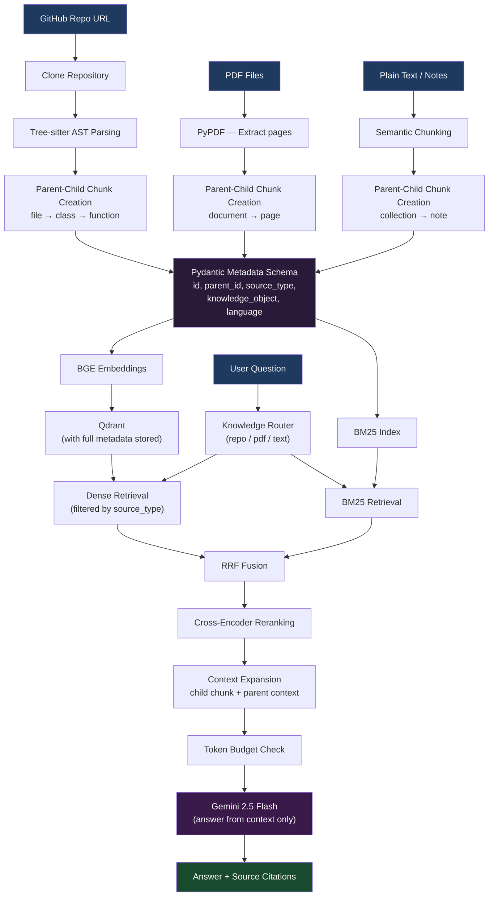

# Notebook 3 — Contextual Retrieval: Metadata, Parent-Child Chunks, and Multi-Source Ingestion

This notebook is about making retrieval smarter by adding more context to every chunk.

Notebooks 1 and 2 stored chunks with basic information — the text and where it came from. This notebook adds a richer metadata layer that tells the system *what kind of thing* a chunk is, *where it fits* in the document structure, and *how it relates to other chunks*.

It also introduces **parent-child chunking**, which means small chunks can "look up" to get the larger section they belong to for more context.

---

## System Architecture



---

## What This Notebook Does

It builds a multi-source knowledge base from GitHub repositories and PDF files, with a structured metadata layer attached to every chunk. Then it uses that metadata to retrieve not just matching chunks but also their surrounding context.

---

## What Changed From Notebook 2

| Feature | Notebook 2 | Notebook 3 |
|---------|------------|------------|
| Metadata | Basic (source, page) | Full Pydantic schema with types, IDs, parent links |
| Chunking | Flat chunks | Parent-child hierarchy |
| Context at retrieval | Just the chunk | Chunk + parent context |
| Validation | None | Pydantic data models |

---

## The Core Idea — Parent-Child Chunking

Imagine a Python file with a class that has three methods. If you split this into small chunks:

```
Chunk A: "class UserService:"
Chunk B: "    def create_user()"
Chunk C: "    def get_user()"
Chunk D: "    def delete_user()"
```

Now if someone asks "how does UserService work?", you might only retrieve Chunk B. But the answer is incomplete without knowing it belongs to `UserService`.

With parent-child relationships:

```
Parent: UserService class (with a summary of what it does)
  ├── Child: create_user method
  ├── Child: get_user method
  └── Child: delete_user method
```

When Chunk B is retrieved, the system also fetches its parent context (`UserService`) and includes both in the answer. This gives the LLM much better context to work with.

---

## The Metadata Schema

Every chunk has a structured metadata object (built with Pydantic) that includes:

- **id** — a unique ID for this chunk
- **parent_id** — the ID of the parent chunk (if this is a child)
- **source_type** — is this from a repo, a PDF, or plain text?
- **knowledge_object** — is this a file, class, function, or document section?
- **document_name** — which file or PDF does this come from?
- **page_number** — for PDFs, which page?
- **language** — for code, what programming language?

This metadata is stored alongside the embedding in Qdrant.

---

## Multi-Source Ingestion Pipeline

The system can ingest:

**GitHub Repositories:**
```
GitHub URL
    ↓
Clone repository
    ↓
Parse with Tree-sitter
    ↓
Extract files, classes, functions
    ↓
Create parent-child chunks
    ↓
Generate embeddings
    ↓
Store in Qdrant with metadata
```

**PDF Files:**
```
PDF file
    ↓
Extract text page by page
    ↓
Semantic chunking
    ↓
Link chunks to their document (parent)
    ↓
Generate embeddings
    ↓
Store in Qdrant with metadata
```

---

## Knowledge Routing

The same routing idea from Notebook 2 is here. Before retrieval, the system checks whether the question is about code or documents, and filters the search accordingly using the `source_type` metadata.

This means if you ask a code question, it does not waste time searching through PDF chunks.

---

## Context Expansion at Retrieval Time

This is the key feature added in this notebook.

When a child chunk is retrieved:

1. Look up its `parent_id`
2. Fetch the parent chunk text
3. Include both in the context sent to the LLM

```
Retrieved: create_user() method (child)
Parent context: UserService class

→ LLM sees both → gives a better answer
```

The `MAX_CONTEXT_TOKENS` limit still applies. If adding the parent would exceed the budget, the parent is truncated.

---

## Answer Generation

The same Gemini 2.5 Flash model is used here. The LLM receives:
- The retrieved child chunks
- Their parent contexts
- A prompt requiring it to answer from the provided context only

---

## Tools Used

| Tool | What it does |
|------|-------------|
| Pydantic | Validates metadata schemas |
| Tree-sitter | Parses code structure |
| GitPython | Clones repositories |
| BGE Small | Generates embeddings |
| Qdrant | Stores embeddings and metadata |
| BM25 | Keyword search |
| Tiktoken | Counts tokens for budget |
| Gemini | Generates final answers |

---

## How to Run

1. Open `2D_metadata_contextual_retrieval.ipynb` in Google Colab
2. Add your `GOOGLE_API_KEY` to Colab secrets
3. Run all cells from top to bottom
4. Use the Gradio interface to ingest a repo or PDF and ask questions

---

## Why Pydantic for Metadata?

I could have used plain Python dictionaries. But dictionaries have no validation — you can put wrong types in, miss required fields, or misspell a key name and not notice until runtime.

Pydantic models validate the data automatically. If a chunk is missing a required field, you get a clear error immediately at ingestion time, not later when retrieval breaks.

---

## What I Learned

- Structured metadata makes the retrieval system much more flexible. You can filter by source type, knowledge type, file name, or any other field.
- Parent-child chunking gives the LLM better context without just dumping the entire document into the prompt.
- Pydantic is the right tool for defining and validating data schemas in Python — especially for anything that touches an LLM where data quality matters.
- Token budgeting becomes more important as you add more context per chunk.
