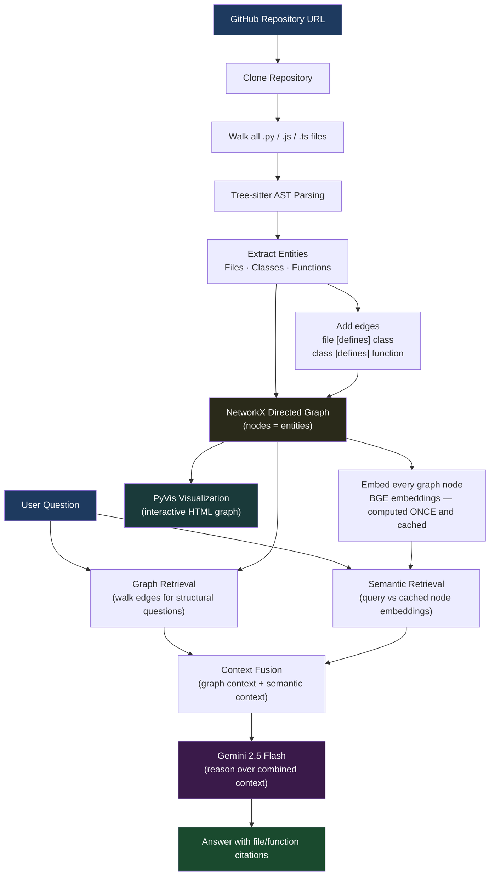

# Notebook 4 — Graph RAG: Turning a Code Repository Into a Knowledge Graph

This notebook is about a completely different way of understanding a codebase.

All the previous notebooks treated code as text — they chunked it, embedded it, and searched it by similarity. That works well for many questions, but it misses something important: **code has structure**.

A function calls another function. A class contains methods. A file imports a module. These relationships exist in the code, but a plain vector search cannot see them.

This notebook turns a GitHub repository into a **knowledge graph** — a network of nodes and edges — and then uses that graph for retrieval. Structural questions like "which file defines the GPT class?" are answered by walking the graph, not by similarity search.

---

## System Architecture



---

## What This Notebook Does

It takes a GitHub repository, parses it into a directed graph using Tree-sitter, and combines graph traversal with semantic search to answer questions about the codebase.

---

## Why Graphs?

Think about this code:

```python
class GPT:
    def forward(self):
        ...
    def generate(self):
        ...
```

A vector search can find `forward()` if you search for something related. But it cannot easily answer:

- "Which file contains the GPT class?"
- "What methods does the GPT class have?"
- "What classes does model.py define?"

These are structural questions. The answer is in the **relationships**, not in the text content.

A knowledge graph represents these relationships directly:

```
model.py  →[defines]→  GPT
GPT       →[defines]→  forward()
GPT       →[defines]→  generate()
```

Now "which file defines GPT?" is just: find the node GPT, follow the [defines] edge backwards to model.py. Done.

---

## Graph Structure

The graph is a directed graph (using NetworkX) with three types of nodes:

- **File** nodes — each `.py`, `.js`, or `.ts` file
- **Class** nodes — each class found in the code
- **Function** nodes — each function or method

And one type of relationship right now:

- **defines** — a file defines a class, a class defines a method, a file defines a function

Example graph for a small repo:

```
model.py
    ↓ [defines]
GPT
    ↓ [defines]
forward()
    
    ↓ [defines]
generate()
```

---

## How the Graph Is Built

```
GitHub repository
    ↓
Clone the repo
    ↓
Parse every file with Tree-sitter
    ↓
Extract files, classes, functions
    ↓
Create a node for each entity
    ↓
Add edges for "defines" relationships
    ↓
Knowledge graph is ready
```

---

## Why Tree-sitter Instead of Regex?

Regex can find patterns like `def ` or `class ` in text, but it does not understand code structure. It will miss things, produce false positives, and break on edge cases.

Tree-sitter parses the actual language grammar and gives you an Abstract Syntax Tree (AST). You can reliably extract exactly which functions belong to which classes, which files contain which definitions, etc.

---

## Graph Embeddings (for Semantic Search)

The graph alone cannot answer every question. Some questions are about meaning, not structure.

For example: "How does attention masking work?" — there is no graph edge for "masking". You need semantic search for this.

So I also generate embeddings for each graph node (using BGE). These embeddings are computed **once** when the graph is built and cached. For every query, I compare the query embedding against the cached node embeddings.

This is much faster than recomputing graph embeddings every time a query comes in.

---

## Hybrid Retrieval — Graph + Semantic

When a question comes in, the system uses both:

**Graph Retrieval** — for structural questions:
```
Question: "Which file defines the GPT class?"
→ Graph walk: find node GPT → follow edges → model.py
```

**Semantic Retrieval** — for conceptual questions:
```
Question: "How does attention masking work?"
→ Embed query → compare to node embeddings → retrieve forward() node
```

The context from both is combined and sent to Gemini.

---

## Example Query Flow

Question: "How does future token masking work?"

1. Graph retrieval finds: `GPT → [defines] → forward()`
2. Semantic retrieval finds: `forward()` function content (most similar to "masking")
3. Both results are merged
4. Gemini generates an answer from the combined context

---

## Graph Visualization

I used PyVis to render the knowledge graph as an interactive HTML visualization. You can zoom in, click nodes, and explore the repository structure visually.

This serves two purposes:
1. Debugging — I can see if the graph was built correctly
2. Understanding — it gives a different perspective on how a codebase is organized

---

## Tools Used

| Tool | What it does |
|------|-------------|
| Tree-sitter | Parses code into AST |
| NetworkX | Builds and stores the directed graph |
| PyVis | Visualizes the graph as HTML |
| BGE Small | Generates embeddings for graph nodes |
| NumPy | Cosine similarity for semantic search |
| Gemini | Generates final answers |
| Gradio | Web interface |

---

## How to Run

1. Open `3D_graph_rag.ipynb` in Google Colab
2. Add your `GOOGLE_API_KEY` to Colab secrets
3. Run all cells from top to bottom
4. Use the Gradio interface to build a graph from a repo URL and ask questions

---

## Why NetworkX Instead of Neo4j?

I considered using Neo4j (a real graph database) but chose NetworkX because:
- It is pure Python — no server to set up
- It is easy to learn and use for experimentation
- It integrates naturally with the rest of the notebook

For a production system with millions of nodes, a real graph database like Neo4j would be the right choice. NetworkX was the right choice for learning and prototyping.

---

## Current Limitations

Right now the graph only models:

```
File → [defines] → Class / Function
```

It does **not** yet model:
- `Function → [calls] → Function`
- `File → [imports] → Module`
- `Class → [inherits] → Class`

These relationships exist in the code but are harder to extract from the AST. They are the natural next step for future versions.

---

## What I Learned

- Graphs are a natural way to represent code structure that vector search cannot capture
- Hybrid retrieval (graph + semantic) handles a wider range of questions than either alone
- Caching embeddings after graph construction makes queries much faster
- Visualization is genuinely useful — both for debugging and for understanding a codebase from a new angle
- The choice between graph databases (Neo4j) and in-memory graphs (NetworkX) depends on scale
