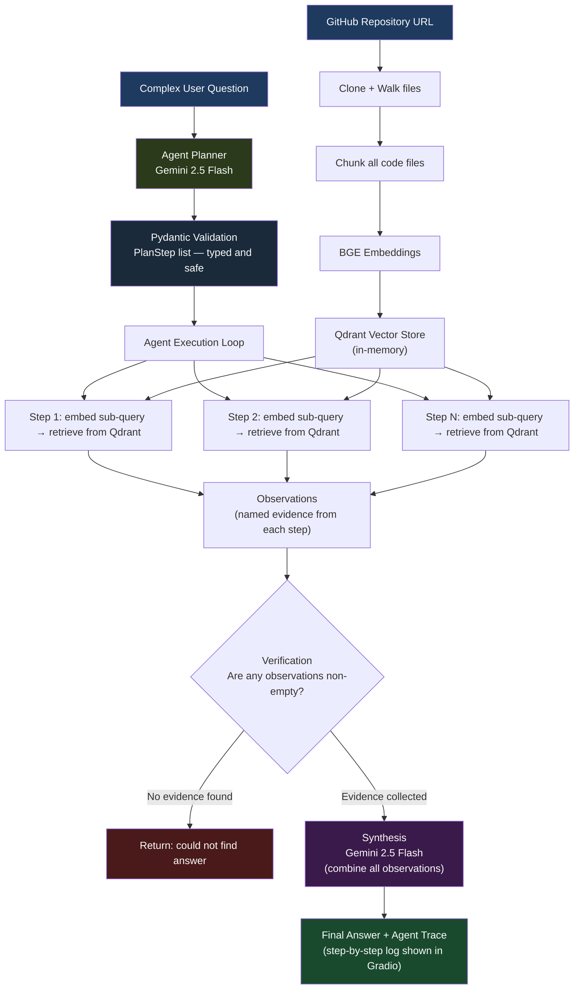

# Notebook 5 — Agentic RAG: Planning Before Retrieving

All the previous notebooks followed a simple flow:

```
Question → Retrieve → Answer
```

That works well for simple questions. But what about a question like:

**"How does user authentication connect to user creation, and what shared logic do they use?"**

A single retrieval step might find something about auth, or something about user creation — but not necessarily both, and not the connection between them. To answer this well, you need to:

1. Understand what the question is really asking
2. Decide what pieces of information you need
3. Retrieve those pieces separately
4. Check that you actually found useful information
5. Combine everything into a final answer

This is what an **agent** does. It plans before it acts.

---

## System Architecture



---

## What This Notebook Does

It introduces an orchestration layer that sits on top of retrieval. Before searching for anything, a **planner** (Gemini) breaks the question into retrieval steps. Each step is executed, the results become **observations**, those observations are validated, and finally everything is synthesized into a final answer.

---

## The Workflow

```
Question
    ↓
Planner (Gemini)
    ↓
Retrieval Plan (list of sub-queries)
    ↓
Execute each sub-query against Qdrant
    ↓
Collect observations
    ↓
Verify observations (did we actually find something?)
    ↓
Synthesize final answer (Gemini)
```

---

## The Planner

The planner takes a question and outputs a structured plan — a list of retrieval steps with specific queries.

Example:

**Question:** "How does authentication connect with user creation?"

**Generated plan:**
```
Objective: Understand how authentication and user creation workflows interact

Step 1: Retrieve authentication workflow
Query: "authentication flow login token"

Step 2: Retrieve user creation workflow
Query: "user creation registration signup"

Step 3: Find shared components
Query: "shared validation database user service"

Confidence: 0.92
```

The plan is a Pydantic model (typed and validated), so the agent can safely iterate over the steps.

---

## Why Pydantic for the Plan?

The planner outputs JSON, but raw JSON has no guarantees. You might get the wrong field names, missing fields, or wrong types.

Pydantic parses and validates the output automatically. If a step is missing its query field, you get a clear error immediately — not a confusing failure later when the agent tries to execute the step.

---

## The Retrieval Layer

Each step in the plan gets executed using:
- BGE embeddings (same as before)
- Qdrant vector database

The results from each step become **observations** — named pieces of evidence with their source and content.

```
Observation 1: "auth_service.py — handles login and token generation"
Observation 2: "user_service.py — handles user creation and validation"
Observation 3: "validators.py — shared validation used by both"
```

---

## The Verification Layer

Before generating the final answer, the agent checks: did we actually retrieve useful information?

This prevents the LLM from reasoning over empty context and making things up. If a step returned nothing, the verification layer flags it.

The current implementation is simple (just checking if observations are non-empty). Future versions could include confidence scoring, reflection, or LLM-based validation of whether the evidence actually answers the question.

---

## Final Synthesis

All validated observations are packaged into a single context block and sent to Gemini with instructions to:
- Answer from the provided evidence only
- Explain how the retrieved pieces connect to each other
- Not make up information beyond what was retrieved

---

## Example Full Run

**Question:** "How does authentication connect with user creation?"

**Plan:**
- Step 1: retrieve auth workflow
- Step 2: retrieve user creation workflow
- Step 3: find shared services

**Observations:**
- Auth service: handles login, issues JWT tokens
- User service: handles registration, stores users
- Shared: both call the same input validation module

**Verification:** all observations non-empty, proceed

**Final answer:** "Authentication and user creation are connected through a shared input validation module. After a user is created in user_service.py, future login attempts in auth_service.py go through the same validation logic before issuing a JWT token."

---

## Why I Did Not Use LangChain

I could have used LangChain or LangGraph to build this agent with much less code. But the point of this notebook is to understand what an agent actually does, not just to use a library.

By building the planner, executor, observation layer, verification layer, and synthesizer by hand, I learned exactly what each piece does and why it is needed.

Once you understand the mechanics, using LangChain or LangGraph makes much more sense because you know what is happening inside the abstractions.

---

## Tools Used

| Tool | What it does |
|------|-------------|
| Gemini 2.5 Flash | Planner and final synthesizer |
| Pydantic | Validates the structured plan |
| BGE Small (Sentence Transformers) | Query embeddings |
| Qdrant | Vector search for each plan step |
| Gradio | Web interface |

---

## How to Run

1. Open `4D_agentic_rag_.ipynb` in Google Colab
2. Add your `GOOGLE_API_KEY` to Colab secrets
3. Run all cells from top to bottom
4. Use the Gradio interface to ask complex multi-part questions and watch the agent plan and retrieve

---

## What Changed Compared to Previous Notebooks

| Aspect | Notebooks 1–4 | Notebook 5 |
|--------|---------------|------------|
| Retrieval trigger | Direct search on question | Planner decides what to search |
| Number of retrievals | One | Multiple (one per plan step) |
| Evidence collection | Single results list | Named observations with sources |
| Validation | None | Observation verification step |
| Answer generation | Chunks → LLM | Observations → synthesis → LLM |

---

## Current Limitations

- The knowledge base in this notebook is small (a demonstration set)
- The verification layer only checks if observations exist, not if they are actually relevant
- The agent does not replan if a step fails to find anything
- No long-term memory between sessions

These are natural next steps toward a production-grade agentic system.

---

## What I Learned

- Planning before retrieving handles multi-part questions much better than a single retrieval step
- Structured outputs (Pydantic) make agent workflows reliable and debuggable
- The observation pattern (evidence → named observations → synthesis) is a clean architecture for agentic systems
- Building an agent without a framework is hard, but teaches you exactly what frameworks are doing for you
- The progression from "retrieve and answer" to "plan, retrieve, verify, synthesize" is a fundamental shift in how AI systems handle complex reasoning
