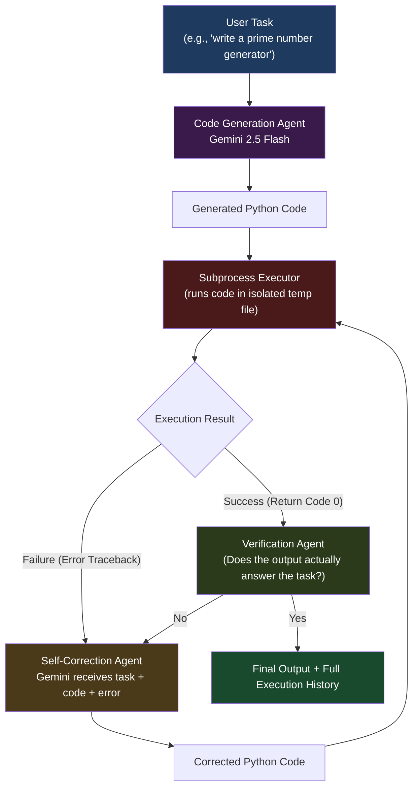

# Notebook 6 — Self-Correcting Code Agent: Write, Run, Fix, Verify

This notebook is about building an agent that does not just generate answers — it takes **actions**, observes what happens, and **fixes its own mistakes**.

Every previous notebook retrieved information and asked an LLM to answer from it. This notebook goes further. The agent writes Python code, actually runs it, looks at whether it worked or failed, and if it failed, it tries to fix the code and run it again.

This is the **Reason → Act → Observe → Correct** loop that is at the heart of autonomous AI agents.

---

## What This Notebook Does

You give the agent a coding task — like "write a function that finds all prime numbers below 100" — and it:

1. Generates Python code using Gemini
2. Runs the code using a Python subprocess
3. Looks at the output or error message
4. If it failed: sends the error back to Gemini for correction
5. Runs again with the corrected code
6. Repeats up to a maximum number of attempts
7. Verifies that the final output actually makes sense

---

## Why This Matters

Most LLM systems generate a response and stop. If the generated code has a bug, the user has to copy it, run it, see the error, go back to the LLM, paste the error, wait for a fix, and repeat manually.

This notebook automates that loop. The agent is its own debugger.

---

---

## System Architecture



---

## Stage 1 — Code Generation

Gemini receives the task and generates Python code.

**Example task:** "Calculate the factorial of 5"

**Generated code:**
```python
print(factorial(5))
```

Notice the bug — `factorial` is not defined. This code will fail.

---

## Stage 2 — Subprocess Execution

The generated code is written to a temporary file and executed with:

```
python temp_code.py
```

The stdout and stderr are both captured.

**Execution result:**
```
NameError: name 'factorial' is not defined
```

---

## Stage 3 — Self-Correction

When execution fails, the agent sends three things to Gemini:

1. The original task
2. The code that was generated
3. The error message

Gemini returns corrected code:

```python
def factorial(n):
    if n == 0:
        return 1
    return n * factorial(n - 1)

print(factorial(5))
```

The corrected code runs again.

**Result:** `120`

---

## Stage 4 — Verification

Execution success does not always mean correctness. A function could run without errors but return a wrong answer.

The verification agent checks:
- Did execution succeed?
- Does the output look reasonable for the given task?
- Are there any suspicious patterns?

This is a lightweight sanity check. Future versions could use unit tests or a separate grading LLM.

---

## Execution History

Every attempt is recorded:

```
Attempt 1
  Status: Failed
  Error: NameError: name 'factorial' is not defined

Attempt 2
  Status: Success
  Output: 120
```

This gives full transparency into the correction process. You can see exactly what went wrong and how it was fixed.

---

## Note on Security

This notebook uses Python subprocess execution. It is not a fully isolated sandbox. Generated code runs in the same environment as the notebook.

This is fine for educational purposes. For a production system that runs untrusted code, you would need Docker isolation or a proper sandboxed execution environment.

---

## Tools Used

| Tool | What it does |
|------|-------------|
| Gemini 2.5 Flash | Code generation and self-correction |
| Python subprocess | Executes generated code |
| Pydantic | Validates execution result structures |
| Gradio | Web interface |

---

## How to Run

1. Open `5D_rlm_repl_fixed.ipynb` in Google Colab
2. Add your `GOOGLE_API_KEY` to Colab secrets
3. Run all cells from top to bottom
4. Use the Gradio interface to give coding tasks and watch the agent run and fix code

---

## Why I Did Not Use LangChain

Same reason as Notebook 5. I wanted to build the execution loop, the observation layer, and the correction mechanism by hand so I fully understand each part before using an abstraction layer.

Frameworks like LangGraph can do this too, but understanding the pattern first makes you a much better user of those frameworks.

---

## What Changed From Notebook 5

| Aspect | Notebook 5 (Agentic RAG) | Notebook 6 (Code Agent) |
|--------|--------------------------|--------------------------|
| Core capability | Plan and retrieve information | Generate and execute code |
| Agent action | Run retrieval queries | Run Python code |
| Observation | Retrieved chunks | Execution output or error |
| Correction | Not applicable | Self-correct code on error |
| Verification | Check if evidence exists | Check if output is valid |

---

## What I Learned

- The Reason → Act → Observe → Correct loop is a fundamental building block of autonomous agents
- LLMs can generate incorrect code. Execution-based feedback is a reliable way to catch and fix errors automatically
- Recording the correction history makes debugging much easier
- Verification is important even after success — a function that runs but returns the wrong answer is still a failure
- Building this without a framework taught me exactly what "agentic" means at the code level
- This pattern scales: the same loop that fixes code can be adapted to fix database queries, API calls, shell commands, or any other executable action
