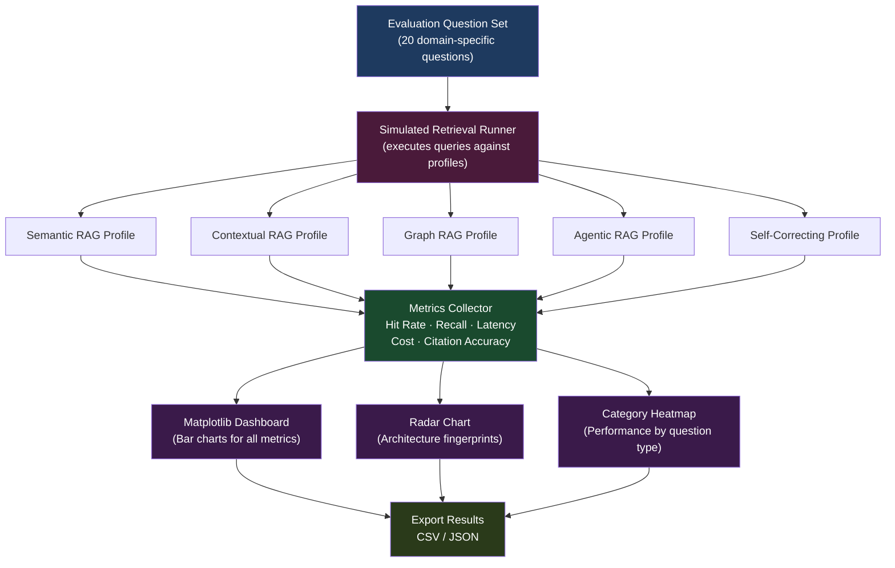

# Notebook 7 — Benchmarking: Comparing All the RAG Architectures

This is the final notebook. After building five different retrieval and agent architectures, it is time to step back and ask: **which one actually performs better, and by how much?**

This notebook introduces a benchmarking framework that lets you measure and compare all the architectures side-by-side using real metrics. You cannot improve something you have not measured. This notebook is about measurement.

---

## System Architecture



---

## What This Notebook Does

It runs a set of evaluation questions through each architecture, records performance metrics (accuracy, speed, cost, citation quality), and generates visual dashboards — heatmaps, radar charts, and trade-off tables — so you can see clearly what each architecture is good at and where it falls short.

---

## Why Benchmarking Matters

Building a system is only half the work. The other half is knowing whether it is actually better than the alternatives.

Questions this notebook helps answer:

- Does Graph RAG retrieve more accurately than plain Semantic RAG?
- How much slower is Agentic RAG compared to a direct retrieval pipeline?
- Does Contextual RAG use more tokens per query?
- Which architecture gives the most complete citations?
- What is the trade-off between retrieval quality and cost?

Without benchmarking, these are just guesses.

---

## The Evaluation Questions

The benchmark uses a set of realistic repository-focused questions:

```
"How is user authentication implemented?"
"Which file initializes the application?"
"How are database models defined?"
"What external APIs are called?"
"How does user creation connect to authentication?"
"Which module defines the GPT model?"
"How is attention masking implemented?"
"What file contains the configuration logic?"
"How are embeddings generated?"
"How are requests validated?"
```

These questions represent common tasks when working with a codebase. Some are structural (which file contains X?) and some are conceptual (how does X work?).

---

## The Architectures Being Compared

| Name | What it is |
|------|-----------|
| Semantic RAG | Basic embedding + vector search (Notebook 1) |
| Contextual RAG | Metadata + parent-child chunks (Notebook 3) |
| Graph RAG | Knowledge graph + semantic search (Notebook 4) |
| Agentic RAG | Planning + multi-step retrieval (Notebook 5) |
| Self-Correcting Agent | Code execution + correction loop (Notebook 6) |

---

## The Metrics

### Hit Rate
Did the system retrieve at least one relevant result? Higher is better.

### Recall
Of all the relevant information that exists, how much did the system actually retrieve? Higher means more complete retrieval.

### Latency
How long did it take to get an answer? Lower is better for user experience.

### Token Cost
How many tokens were consumed per query? Lower means more efficient and cheaper.

### Citation Accuracy
When the system says it got the answer from file X, is that actually where the answer came from? Higher means more trustworthy answers.

---

## Why Multiple Metrics?

No single number tells the whole story. A system might be:

- Accurate but slow
- Fast but incomplete
- Cheap but inaccurate

You need multiple metrics to make an informed comparison and choose the right architecture for your use case.

---

## A Note on the Current Data

Right now, this notebook uses **simulated performance profiles** for each architecture. Instead of running all five notebooks on the same dataset (which would be very expensive and slow), I assigned representative profiles based on my understanding of each architecture's strengths.

This means the benchmark demonstrates the **framework** — the measurement methodology, visualization pipeline, and reporting workflow — rather than claiming precise real-world numbers.

The design is intentional: the profiles can be replaced with real measurements in a future version by running each notebook against the same evaluation dataset and collecting the metrics directly.

---

## The Visualizations

The notebook generates several types of charts:

**Comparative table** — all architectures × all metrics in one table

**Heatmap** — color-coded table that makes patterns immediately visible

**Radar chart** — shows each architecture as a shape across all metrics. A well-rounded architecture has a large, balanced shape. A specialized one has spikes in some dimensions.

**Trade-off summary** — a plain-text summary of each architecture's key strength and its main trade-off

---

## Trade-Off Summary

| Architecture | Strength | Main Trade-Off |
|-------------|----------|----------------|
| Semantic RAG | Fast, simple | Limited context, weaker for structural questions |
| Contextual RAG | Rich context | Higher token usage per query |
| Graph RAG | Excellent for structural questions | Complex setup, harder to scale |
| Agentic RAG | Handles complex multi-part questions | Slower, more API calls |
| Self-Correcting Agent | Reliable code execution | Not focused on retrieval accuracy |

---

## Tools Used

| Tool | What it does |
|------|-------------|
| Matplotlib | Generates all charts and heatmaps |
| NumPy | Metric calculations |
| Pandas | Organizes data into tables |

---

## How to Run

1. Open `6D_comparative_eval.ipynb` in Google Colab
2. No API keys needed for the simulated version
3. Run all cells from top to bottom
4. Review the generated charts and trade-off tables

---

## How to Extend This to Real Benchmarks

To replace simulated data with real measurements:

1. Create a shared evaluation dataset (the 10 questions above or your own)
2. Run each notebook against that dataset
3. Record hit rate, recall, latency, token count, and citation accuracy for each query
4. Plug those real numbers into the metrics engine
5. The dashboard and charts work without any changes

The framework is already designed for this. Only the data source needs to change.

---

## What I Learned

- Benchmarking is a skill separate from building. You need to define what "better" means before you can measure it.
- No architecture wins on all metrics. Every improvement has a trade-off.
- Heatmaps and radar charts make multi-dimensional comparisons much easier to understand than a plain table.
- The habit of measuring first and optimizing second is one of the most important engineering practices.
- Simulated benchmarks are useful for validating the framework before the cost of running real experiments.

---

## Project Complete

This notebook closes the full progression:

```
Notebook 1: Basic hybrid RAG on PDFs
    ↓
Notebook 2: Multi-source RAG with code understanding
    ↓
Notebook 3: Richer metadata and parent-child context
    ↓
Notebook 4: Graph-based retrieval for code structure
    ↓
Notebook 5: Planning before retrieving (Agentic RAG)
    ↓
Notebook 6: Execute, observe, correct (Code Agent)
    ↓
Notebook 7: Measure and compare everything
```

From loading a single PDF to building a system that plans, executes code, fixes its own mistakes, and measures its own performance — this is the full arc of learning RAG from scratch.
