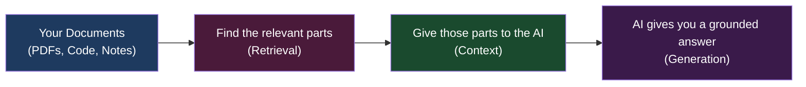
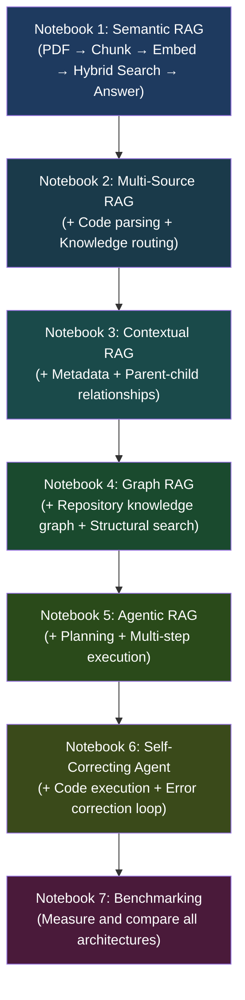

# RAG From Scratch — My Learning Journey

This is my personal project where I learned how Retrieval-Augmented Generation (RAG) works by building it step by step, from the simplest version all the way to agents that can plan, execute code, and fix their own mistakes.

I built 6 notebooks across 7 folders. Each one adds something new on top of the previous one. By the end, you will have a clear picture of how modern AI retrieval systems actually work — not just the theory, but real code you can run.

---

## What is RAG?

RAG stands for Retrieval-Augmented Generation.

The basic idea is simple. Instead of asking an AI to answer from memory (which leads to wrong answers), you first find the relevant information from your own documents, then give that information to the AI, and then ask it to answer.



This reduces hallucinations (made-up answers) and lets you ask questions about your own private documents.

---

## The 7 Notebooks — What Each One Does

| Folder | Notebook | What I Learned |
|--------|----------|----------------|
| 01_TraceIQ_PDF_RAG | TraceIQ — PDF RAG | Hybrid retrieval from PDFs: semantic search + BM25 + reranking |
| 02_TraceIQ_Advanced_RAG | TraceIQ — Advanced RAG | Multi-source search across GitHub repos, PDFs, and text with AST code parsing |
| 03_Contextual_Retrieval | Contextual Retrieval | Metadata schemas, parent-child chunks, smarter context at retrieval time |
| 04_Graph_RAG | Graph RAG | Turning a code repository into a knowledge graph and searching it structurally |
| 05_Agentic_RAG | Agentic RAG | A system that plans what to retrieve instead of just retrieving once |
| 06_Self_Correcting_Agent | Self-Correcting Code Agent | An agent that writes code, runs it, fixes its own errors, and verifies output |
| 07_Benchmarking | Benchmarking | Comparing all architectures side-by-side using real metrics |

---

## How the Project Grows

Every notebook builds on the last one. You can follow the progression from simple to complex:



---

## What Tools and Libraries I Used

- **Groq / Gemini** — the language models that generate answers
- **Qdrant** — vector database to store and search embeddings
- **Sentence Transformers (BGE)** — converts text into vectors
- **BM25** — classic keyword search
- **Tree-sitter** — parses code into syntax trees (AST)
- **NetworkX** — builds and traverses knowledge graphs
- **PyVis** — visualizes graphs in the browser
- **Gradio** — interactive web interface used in all notebooks
- **Pydantic** — validates structured data
- **PyPDF** — extracts text from PDF files
- **Tiktoken** — counts tokens for context budgeting
- **GitPython** — clones GitHub repositories

---

## How to Run Each Notebook

Each notebook is designed to run in **Google Colab**. Open the `.ipynb` file in Colab, add your API keys in the Colab secrets panel, and run all cells from top to bottom.

The Gradio interface launches at the bottom of each notebook — no extra setup needed.

**API keys you may need:**

| Key | Which notebooks | Where to get it |
|-----|----------------|----------------|
| `GROQ_API_KEY` | Notebook 1, 2 | [console.groq.com](https://console.groq.com) |
| `GOOGLE_API_KEY` | Notebooks 3, 4, 5, 6, 7 | [aistudio.google.com](https://aistudio.google.com) |

---

## Folder Structure

```
PAIML/
├── README.md                                        ← you are here
│
├── 01_TraceIQ_PDF_RAG/
│   ├── TraceIQ_PDF.ipynb                            ← Notebook 1: PDF RAG
│   └── README.md
│
├── 02_TraceIQ_Advanced_RAG/
│   ├── 1_2DTraceIQ_Advanced_RAG_.ipynb              ← Notebook 2: Advanced RAG
│   └── README.md
│
├── 03_Contextual_Retrieval/
│   ├── 2D_metadata_contextual_retrieval.ipynb       ← Notebook 3: Contextual Retrieval
│   └── README.md
│
├── 04_Graph_RAG/
│   ├── 3D_graph_rag.ipynb                           ← Notebook 4: Graph RAG
│   └── README.md
│
├── 05_Agentic_RAG/
│   ├── 4D_agentic_rag_.ipynb                        ← Notebook 5: Agentic RAG
│   └── README.md
│
├── 06_Self_Correcting_Agent/
│   ├── 5D_rlm_repl_fixed.ipynb                      ← Notebook 6: Self-Correcting Agent
│   └── README.md
│
└── 07_Benchmarking/
    ├── 6D_comparative_eval.ipynb                    ← Notebook 7: Benchmarking
    └── README.md
```

---

## Why I Built This

I wanted to understand RAG from the ground up, not just use a library that hides all the details.

So I started with the simplest possible version — loading a PDF, splitting it into chunks, searching for the relevant ones, and asking an LLM to answer from those chunks.

Then I kept adding more pieces — better search, code understanding, graph retrieval, planning, self-correction — until I had a full picture of how production RAG systems are built.

If you are also trying to learn RAG, I hope these notebooks help you the same way building them helped me.

---

## Key Things I Learned

- Chunking strategy matters a lot. Semantic chunking keeps related ideas together.
- Keyword search (BM25) and semantic search each have strengths. Combining them gives better results than either alone.
- Cross-encoder reranking significantly improves which chunks get sent to the LLM.
- Graphs are a natural way to represent code structure that vector search cannot capture.
- Agents that plan before retrieving handle complex multi-part questions better.
- Self-correction loops (generate → run → fix → verify) are a core building block of autonomous AI systems.
- Benchmarking is essential. You cannot improve what you do not measure.
